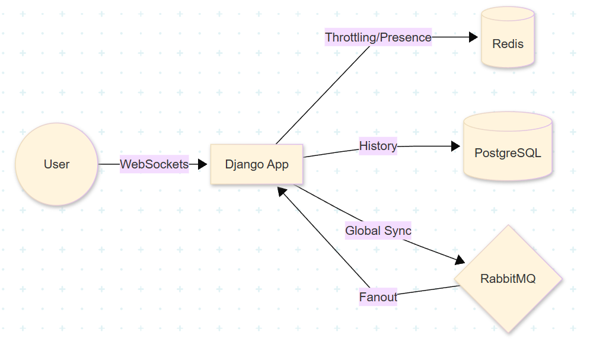

# Distributed Real-Time Chat System

A high-concurrency, distributed chat application built with **Django Channels**, **RabbitMQ**, and **WebSockets**. This project implements a stateless backend architecture, allowing the application to scale across multiple server instances while maintaining a synchronized global chat state.

## 🚀 Key Features
* **Real-Time Messaging:** Sub-millisecond message delivery using WebSockets and Daphne.
* **Horizontal Scalability:** Uses **RabbitMQ Fanout** exchanges to broadcast messages between isolated Docker containers.
* **JWT Authentication:** Secure user registration and login using JSON Web Tokens.
* **Persistent Storage:** Robust message history and user data managed by **PostgreSQL**.
* **Presence & Interaction:** Real-time online user count and dynamic typing indicators.
* **Clean Code Architecture:** Logic separated from configuration for maximum security.

---

## 🏗 System Architecture

